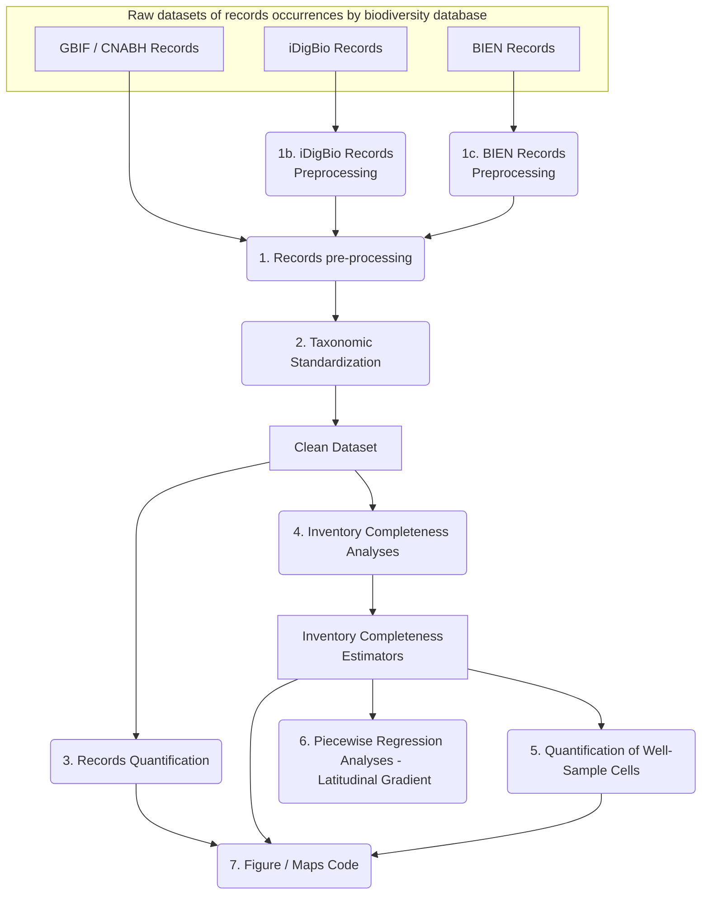

# bioDivRecordsAnalyses
This repository contains R Scripts to perform and reproduce all the analyses and figures of 'Exploring the impact of data curation criteria on the observed geographical distribution of mosses'
It also includes the shapefiles and data used.

**Cite as:**
Ronquillo, C., Stropp, J., Medina, N.G. & Hortal, J. (2023). Exploring the impact of data curation criteria on the observed geographical distribution of mosses. _Ecology and Evolution_

# Workflow
The following **diagram** describes the workflow in which the scripts are organized to reproduce the methods sections of the paper.

